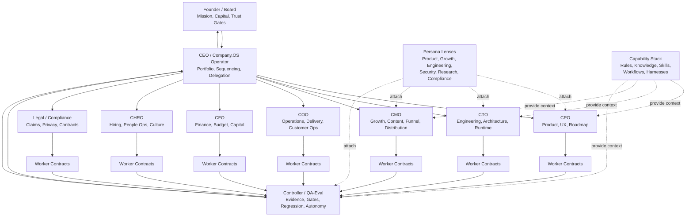

# Company.OS Agent Org Model

Status: canonical productizable model
Current Company.OS version: `0.2.0-alpha.1`
Use for: designing role ownership, worker delegation and gate authority in a
Company.OS installation
Last updated: 2026-05-08

## Purpose

Company.OS separates organization, runtime and judgment.

The core mistake in agentic companies is treating one field, usually assignee or
agent, as if it meant ownership, execution, review and approval. Company.OS does
not do that. It splits the operating model into accountable roles, runtime
workers, independent controllers, capability profiles and human gates.

## Canonical Structure

```text
Founder / Board
-> CEO / Operating System
-> C-Level RoleOwners
-> Worker Runtimes
-> Controller / QA-Eval
-> HumanGate only when required
```

The system uses these layers:

| Layer | Owns | Does not own |
|---|---|---|
| Founder / Board | Mission, capital, trust boundary, HG-4 decisions | Routine worker detail |
| CEO / Operator | Portfolio, prioritization, sequencing, delegation, HG-3 critical reversible decisions | Final strategic trust boundary without Founder gate |
| C-Level RoleOwner | Department bar, strategy, acceptance criteria, work slicing | Runtime identity or unconditional release |
| Controller / QA-Eval | Gate verdicts, evidence review, rework decisions, autonomy recommendation | Producing the same work being judged |
| Worker Runtime | Bounded audit, plan, implementation, report or verification | Scope expansion, Done, merge, deploy, spend |
| Persona Lens | Perspective, heuristics, review questions, style bar | Ownership, assignment or gate authority |
| Capability Stack | Rules, knowledge, workflows, skills, tools, harnesses | Accountability |

## Non-Negotiable Separation

Every serious work order must be able to answer these questions separately:

```text
Who is accountable?        RoleOwner
Who performs the work?     Agent / RuntimeAdapter
Who reviews the work?      Controller / OutcomeGrader
Who can release the gate?  HumanGateOwner or delegated CEO/controller lane
What context may be used?  CapabilityProfile
What quality bar applies?  OutcomeSpec / Harness
What state is emitted?     EventPolicy
What memory may change?    DreamPolicy / MemoryUpdatePolicy
```

This lets a marketing-owned workstream use a low-cost planning worker, a
specialist research worker, a controller review and a CEO synthesis without
pretending that one user or bot owns the entire process.

## Organization Diagram



## Department Model

Company.OS should support these departments as first-class operating lanes.
The daily operating and escalation rules for these lanes are defined in
`docs/operations/department-operating-doctrine.md`.

| Department | RoleOwner | Primary output | Typical automation ceiling before proof |
|---|---|---|---|
| Engineering | CTO | code, architecture, tests, sandbox PRs, daily engineering reports | L3 sandbox |
| Website / Web Ops | CTO or CMO | pages, SEO fixes, deploy packets | L3 sandbox, L4 after review |
| Product | CPO | roadmap, specs, UX, acceptance criteria | L2/L3 |
| Marketing / Growth | CMO | offers, campaigns, funnels, analytics | L2, L3 for drafts/assets |
| Social / Content | CMO | posts, replies, scripts, content calendar | L2 drafts, HG-3 send/publish |
| Creative / Video | CMO or Creative Lead | video scripts, assets, edits, render packets | L2/L3 local artifacts |
| Customer Ops | COO | support workflows, handover packets, QA summaries | L2, L3 for internal docs |
| Sales / BD | COO or CRO | account plans, CRM hygiene, outreach drafts | L2, HG-3 external send |
| Finance | CFO | budgets, cost controls, cash reports | L2, HG-3 spend |
| HR / People | CHRO | hiring funnels, scorecards, onboarding | L2, HG-3 contracts/offers |
| Legal / Compliance | CLO or Compliance | policy, review, claim gates, privacy checks | L2, HG-3 legal/regulated |
| Data / Analytics | CTO or COO | dashboards, metrics, event reducers | L3 sandbox |
| Knowledge / Memory | Controller or COO | SOPs, memory proposals, knowledge hygiene | proposal-only until reviewed |

## Persona Lenses

Personas are optional thinking lenses. They are not org chart nodes.

Good use:

- A CMO attaches a growth lens to pressure-test an offer.
- A CPO attaches a product lens to reduce UX complexity.
- A CTO attaches an engineering lens to question runtime complexity.
- A Controller attaches an adversarial audit lens to search for contradictions.

Bad use:

- `RoleOwner: Growth Persona`
- `Assignee: Famous Expert`
- a worker decides production, legal, medical, spend or public release because
  its persona sounded confident

## Capability Stack

Capability is inherited explicitly, not magically.

```text
RuleSet: hard constraints
KnowledgeBase: canonical domain and architecture knowledge
Workflow: repeatable process
SkillPack: tool or domain capability
PersonaLens: optional perspective
Harness: review and score mechanism
RuntimeAuth: required credentials/sentinels
ForbiddenTools: hard blocks
HumanGates: trust boundaries
```

Use `docs/templates/capability-profile.md` for the copyable template.

## Claude Code As C-Level Worker Runtime

Claude Code is the default high-context C-level worker runtime when a work item
needs broad local context, project tools, plugins, MCP connectors, commands,
subagents and synthesis. It is not automatically the controller.

Claude Code may act as CTO, CPO, CMO, COO or CFO worker/coordinator only when
the Plane item declares:

- `Agent: claude`
- `RuntimeAdapter: local-cli`
- `CapabilityProfile`
- `DreamPolicy` / `MemoryUpdatePolicy`
- `SessionPolicy`
- `SubAgentRoster`, if any subagents may be used

The source of truth is
`docs/orchestration/claude-clevel-worker-runtime.md`.

Operationally:

- Claude can use powerful connectors only when the CapabilityProfile allows
  them.
- Claude can spawn subagents only inside a locked Plane item and only from the
  declared roster.
- Claude must return reflection and learning proposals so the system improves
  after each run.
- Claude must not be CAO for its own work, must not mark Done and must not write
  durable memory unless the memory policy explicitly allows it.

## Role Identity Registry

Email addresses and app users can be useful, but they are not the source of
truth for ownership.

Create a role identity registry before creating many mailboxes:

```yaml
roles:
  - role_id: CTO-COMPANY
    display_name: Company CTO Agent
    role_owner: CTO
    department: Engineering
    workspace_scope:
      - registry:product
      - registry:website
    email_alias: cto@example.com
    app_user: pending
    allowed_runtimes:
      - local-cli
      - managed-agent
    default_persona_lens:
      - engineering
      - security
    default_workflows:
      - agentic-plan
      - test-driven-development
      - deep-audit
    human_gates:
      - production
      - schema-auth
      - security
```

Recommended order:

1. Parseable `RoleOwner` fields.
2. Role identity registry.
3. Email alias or group for active roles.
4. App user or service account when a tool needs native identity.
5. Full mailbox agent only after send gates, audit logs and target policies.

## Worker Contract Extension

High-autonomy work orders should include:

```markdown
RoleOwner:
Department:
AccountableLayer:
Controller:
DecisionOwner:
Agent:
RuntimeAdapter:
Mode:
AutonomyLevel:
CapabilityProfile:
PersonaLens:
OutcomeSpec:
EventPolicy:
DreamPolicy:
SessionPolicy:
SubAgentRoster:
Workspace:
Sandbox:
BranchName:
Dispatch:
RunAt:
DependsOn:
HumanGateLevel:
HumanGateOwner:
BlockedActions:
Reporting:
```

This keeps the work operational for humans, schedulers, workers and
controllers.

## Autonomy Levels

| Level | Meaning | Default release owner |
|---|---|---|
| L0 | Read-only research | automation/controller |
| L1 | Plan, triage, issue draft, local report | controller |
| L2 | Live read-only verification and internal docs | CEO/controller with evidence |
| L3 | Sandbox implementation, draft PR packet, no integration | CEO/controller can prepare, human reviews |
| L4 | Integration PR, staging apply, reversible internal release | delegated human or explicit governance |
| L5 | Production, external send, spend, legal/regulated claim | founder or delegated human |

The autonomy ceiling is per department, per work type and per installed company.
It is not global optimism.

## Current Product Boundary

At `0.2.0-alpha.1`, Company.OS is strong enough to describe and run a hardened
internal L1/L2 operating lane and bounded L3 sandbox lane.

It is not yet a full-company replacement layer. That requires repeated
department-specific proof loops, dashboards, role identity, cloud scheduler
hardening, release gates, security review and human-gate reduction based on
evidence.
