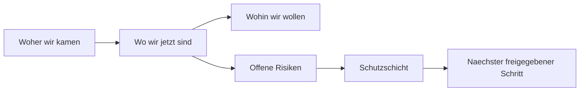

# HumanGate Decision Brief

Use for: any controller-reviewed result that asks a founder, CEO, legal owner,
security owner or delegated human to release a gate.

## Purpose

The HumanGate is not a raw audit dump. It is the decision surface.

It exists because a controller can prove many technical gates but still cannot
fully infer founder taste, trust, risk tolerance, strategy, customer promise or
legal/commercial appetite. The brief must therefore make the decision legible:
where we came from, where we are, where we want to go, what remains risky, and
what the controller recommends.

## Required Shape

Every HumanGate artifact must be written for the gate owner in their decision
language. Private installs should define the default decision language in the
Founder Decision Profile.

Use progressive disclosure. Do not force a long brief for every gate.

## HumanGate Levels

| Level | Use When | Required Artifact |
|---|---|---|
| `HG-0` | In-scope always-allow work; no external impact. | No HumanGate. Record normal controller/run ledger only. |
| `HG-1 Decision Card` | Founder/CEO choice is needed, but blast radius is small and evidence is simple. | 60-second Decision Card. |
| `HG-2 Decision Brief` | Integration, user-data-adjacent code, cross-workspace work, meaningful product/risk tradeoff, or unclear founder preference. | Decision Card first, then brief sections as needed. |
| `HG-3 Decision Dossier` | Production write, schema/RLS/auth/service-role, legal/medical/Rx/public claim, spend, autonomy increase, merge/release with high uncertainty. | Decision Card, full brief, audit evidence, EvalGate/E2E plan, rollback, cross-AI audit when available. |

Rule of thumb:

```text
If the founder can safely answer from the Decision Card, stop there.
If the answer depends on risk interpretation, add the Brief.
If the consequence is hard to reverse, add the Dossier.
```

## Mandatory Decision Card

Every `HG-1+` artifact starts with this machine-readable block plus a short
human summary.

```yaml
human_gate:
  level: HG-1 | HG-2 | HG-3
  requested_decision: GO | GO_MIT_AUFLAGEN | NO_GO | PARKEN
  controller_recommendation: ""
  founder_prediction: ""
  founder_prediction_confidence: 0.0 # 0.0-1.0
  confidence_basis:
    - ""
  consequence_if_go: ""
  consequence_if_no_go: ""
  consequence_if_wrong: ""
  reversible: true | false
  blocked_actions:
    - ""
  next_action_if_approved: ""
```

Short human summary:

```markdown
## Decision Card

- Empfehlung:
- Meine Vorhersage: Der Founder wuerde wahrscheinlich ...
- Konfidenz:
- Warum:
- Konsequenz bei GO:
- Konsequenz bei NO-GO/PARKEN:
- Groesstes Risiko, falls ich falsch liege:
- Blockiert bleibt:
- Naechster Schritt:
```

## Full Brief Template

````markdown
# [Topic] HumanGate Decision Brief

Datum:
Controller:
FounderGateOwner:
Linear:
Workspace:
Artefakte:
Empfehlung:

```yaml
human_gate:
  level:
  requested_decision:
  controller_recommendation:
  founder_prediction:
  founder_prediction_confidence:
  confidence_basis:
  consequence_if_go:
  consequence_if_no_go:
  consequence_if_wrong:
  reversible:
  blocked_actions:
  next_action_if_approved:
```

## Decision Card

- Empfehlung:
- Meine Vorhersage:
- Konfidenz:
- Warum:
- Konsequenz bei GO:
- Konsequenz bei NO-GO/PARKEN:
- Groesstes Risiko, falls ich falsch liege:
- Blockiert bleibt:
- Naechster Schritt:

## 1. Entscheidung

- Controller-Empfehlung:
- Was genau wird freigegeben:
- Was wird nicht freigegeben:
- Erwartete Founder-Reaktion:
- No-Go, wenn:

## 2. Kurzbild



## 3. Woher Wir Kamen

- Ausgangsproblem:
- Warum es wichtig ist:
- Bisheriger Fehler-/Risikotyp:

## 4. Wo Wir Jetzt Sind

- Was wurde gebaut/geaendert:
- Welche Gates sind gruen:
- Welche Gates sind nicht freigegeben:
- State Mapping:

## 5. Wohin Wir Wollen

- Zielbild:
- Was dieses Ergebnis in Zukunft ermoeglicht:
- Welche Autonomie-Stufe dadurch realistischer wird:

## 6. Erkenntnisse

- Technische Erkenntnisse:
- Prozess-Erkenntnisse:
- Founder-Praeferenz, die gelernt werden soll:

## 7. Versteckte Probleme Und Risiken

| Risiko | Warum es relevant ist | Controller-Einschaetzung | Stop-Regel |
|---|---|---|---|
| ... | ... | LOW/MEDIUM/HIGH/CRITICAL | ... |

## 8. Controller-Vorschlag

- Empfohlener Pfad:
- Alternative:
- Warum nicht aggressiver:
- Warum nicht vorsichtiger:

## 9. Schutzschicht

- Sandbox:
- EvalGate:
- E2E/Integration:
- Security/Privacy:
- Rollback:
- Linear/Merge-State:

## 10. Entscheidungsvorlage

Bitte eine der Optionen waehlen:

- `GO`: Controller darf den empfohlenen naechsten Schritt ausfuehren.
- `GO MIT AUFLAGEN`: Controller darf ausfuehren, aber nur mit den genannten
  Aenderungen.
- `NO-GO`: Controller stoppt und erstellt einen Rework-/Audit-Slice.
- `PARKEN`: Ergebnis bleibt dokumentiert, aber wird nicht weiter integriert.
````

## Controller Rules

- Do not ask the gate owner to read raw worker output unless the raw artifact is
  itself the decision object.
- Start with the Decision Card. Detail is optional unless the level is `HG-2` or
  `HG-3`.
- Include at least one simple diagram for non-trivial gates.
- Separate `what is proven` from `what is recommended`.
- Separate `Go for next step` from `Go for merge/ship`.
- State the exact forbidden actions that remain blocked.
- Include the controller's opinion. A HumanGate brief without a recommendation
  wastes CEO/founder attention.
- Include a founder prediction and confidence score. If confidence is below
  `0.70`, the controller should ask a sharper question or recommend a smaller
  reversible next step.
- Convert repeated founder feedback into:
  - decision profile updates
  - controller checklist changes
  - worker issue contract changes
  - eval cases
  - autonomy recommendations

## Minimum Gate Evidence

For code/data/product work, name the exact evidence:

- branch/worktree or artifact path
- changed files or output artifacts
- tests/typechecks/builds
- GitNexus/impact or equivalent blast-radius evidence
- security/privacy check when user data or secrets are nearby
- E2E/integration evidence, or why it is not yet available
- remaining HumanGate stops
